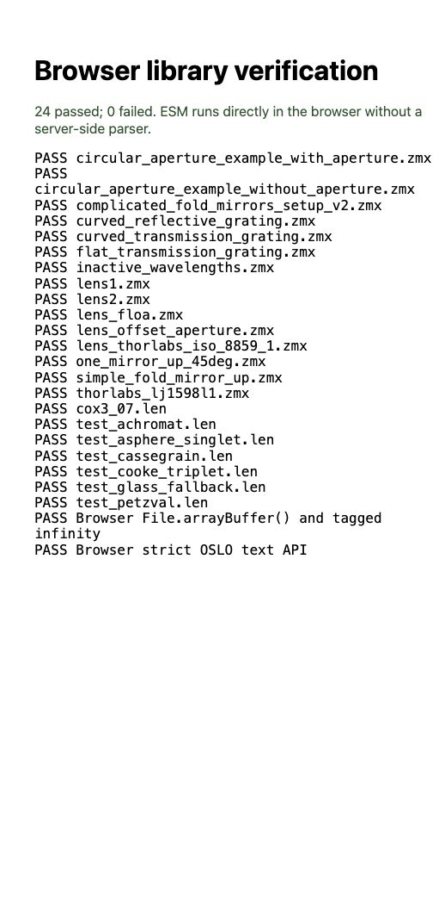

# Local validation — 2026-10-07

Reference: Optiland master at `4e893f53aee1312f2d091680b93dd2279711e197`. Runtime contract: normalized prescription declarations, schema version 1.0. Native optical-engine equivalence is outside this validation.

| Check | Result |
| --- | --- |
| Python unittest suite | 17 passed |
| Python without third-party site packages (`python3 -S`) | 17 passed; no Optiland runtime imported |
| Editable package in a clean virtual environment with isolated Python (`-I`) | Passed |
| TypeScript tests | 34 passed |
| Cross-language corpus | All 15 `.zmx` and 7 `.len` outputs match reviewed Python goldens with numerical tolerance |
| Independent cases | Known geometry, units, quoting, apertures, materials, wavelength slots, configuration/constraint declarations, malformed data and strict diagnostics |
| JSON Schema draft 2020-12 | All 22 Python goldens and TypeScript outputs validate with Ajv |
| TypeScript compiler | Browser ESM and declarations generated successfully |
| Browser verification | 24 passed, 0 failed in the Codex in-app browser |
| Browser demo | Zemax sample: 9 surfaces / 3 wavelengths. OSLO sample: 5 surfaces / 3 wavelengths. JSON output and download control enabled. |
| Distribution checks | Local npm tarball and Python wheel install into separate consumer projects with no runtime dependencies |

Run from the repository root:

```bash
PYTHONPATH=python/src python3 -S -m unittest discover -s python/tests -v
npm --prefix typescript ci
npm --prefix typescript test
npm --prefix typescript run build
python3 -m http.server 8765 --bind 127.0.0.1
```

Open `/typescript/test/browser.html` from that server to rerun the browser checks. The test page fetches fixture bytes and goldens; the imported library itself makes no network calls. Browser verification screenshot:



The suite compares parsed values and declaration preservation. It does not establish resolved catalog dispersion, global optical frames, solved distances, applied image focus, or ray-trace accuracy. Those boundaries are documented in the guide and surfaced in output diagnostics.

Environment used: Python 3.14.8, Node.js 26.10.0, with TypeScript/development package versions pinned by the lockfile. The source targets Python 3.11+ and ES2022-capable browsers. A CI workflow checks Python 3.11 and Node.js 22; this local run does not claim that the remote workflow has already executed.
